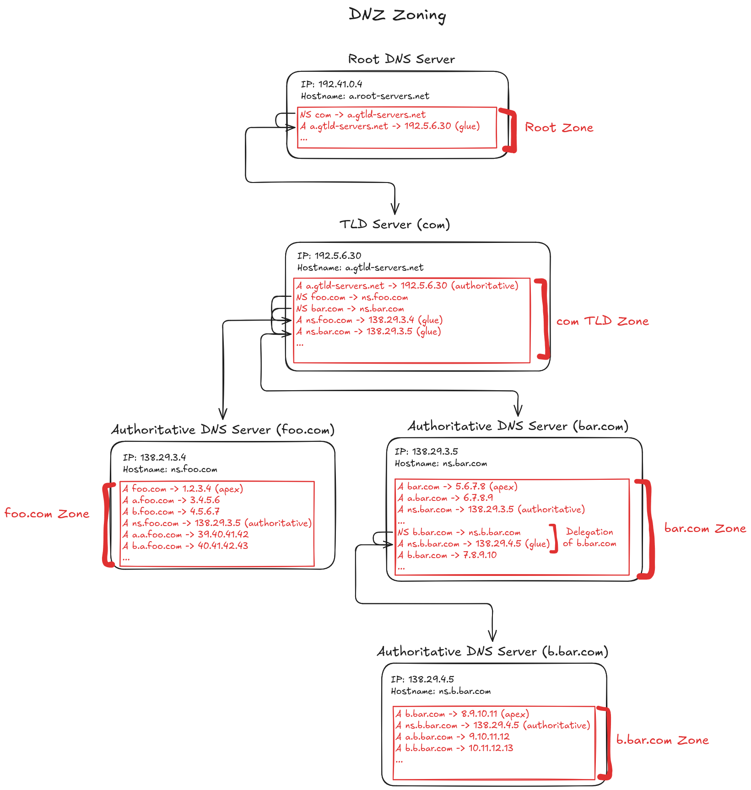

# Application Layer - OSI Model Layer 7

## Head-Of-Line (HOL) Blocking

### Transport Layer

- A TCP connection is a reliable, in-order, bidirectional stream of bytes
- When an application passes a byte stream to a TCP socket, it groups them in-order into segments
- The receiving side buffers incoming segments and reorders them if they arrive out of order
- The TCP socket on the recieving side will not deliver bytes to the application until all earlier bytes are present
- TCP will only deliver a contiguous prefix of the byte stream to the application
- Example:
  - A receiving side receives segments 2, 3, and 4
  - It notices segment 1 is missing
  - Then, it will request retransmission of segment 1 and won't deliver 2, 3, and 4 to the application
  - Even though most data has arrived, TCP will wait and buffer it until all previous data has arrived
  - This is transport-layer head-of-line blocking

### Application Layer

#### HTTP/1.1

##### Without Pipelining

- Only one HTTP request can be handed off to a TCP socket / be in-flight at a time
- The application must wait for the response before sending off the next request
- Requests behave like a FIFO queue (no application-level HOL blocking)

##### With Pipelining

- Multiple HTTP requests can be handed off to a TCP socket / be in-flight at a time
- Multiple responses can't be in-flight, only one at a time
- On the server-side, responses are queued according to which requests arrive first (may not be the same order in which they were sent)
- HOL block occurs because even if other responses are ready to go, they must wait for the current in-flight response to be delivered

##### Workarounds

- Browsers open multiple TCP connections per origin (6-8)
- Requests are then spread across them
- This helps but wastes resources, increases congestion, adds TCP overhead, and only reduces latency rather than eliminating HOL blocking

#### HTTP/2

- HTTP/2 assigns request/response pairs a stream and an ID
- It also breaks down its messages into frames at the application layer
- Each frame is given the stream ID for the respective request/response
- HTTP/2 takes frames from multiple streams and passes them to a TCP socket, interleaving them based on priority and flow control
- If packet loss occurs, HOL blocking still occurs at the transport layer
- Any buffered TCP segments have to wait for the earlier lost segment to be retransmitted
- Any buffered, contiguous TCP segments that build up into frames ready for processing by HTTP/2 at the application layer also have to wait (this is blocking still at the transport-level, not application level)

#### HTTP/3

- HTTP3 eliminates transport-layer blocking entirely

## SMTP

- A user agent allows a user to read, reply to, forward, save and compose e-mails
- When a user sends a message from their user agent, the user agent sends it over to the user's mail server
- The outgoing e-mail is placed in an outgoing message queue
- The mail server sees it in the message queue and sends it over to the recipient's mail server via SMTP (which uses TCP)
- The recipient's mail server receives the e-mail and places it in the recipient's mailbox
- The recipient can then read the e-mail at their convenience
- If more than one e-mail in the message queue goes to the same server, the client sends them over the same TCP connection

## DNS

- The domain name system (DNS) is a distributed database implemented in a hierarchy of DNS servers
- It is also an application-layer protocol that allows hosts to query the distributed database for hostnames that translate to IP addresses
- End systems usually have DNS applications that perform the client-side of DNS (querying)

### Services Provided by DNS

- Host aliasing:
  - A hostname can also have one or more alias names that map to it (aliases)
  - The underlying hostname that maps to the IP is known as the canonical hostname
- Load distribution:
  - Web servers can have multiple replicas with each server running on a different end system
  - For replica web servers, a set of IP addresses is associated with a hostname
  - DNS queries for the hostname are replied with the entire set of IP addresses but the ordering is rotated
  - Clients typically use the IP address at the top of the list so rotation provides load distribution

### DNS Servers

- DNS queries can be recusrive or iterative
- When a requesting host sends a query Q to a recursive resolver to make it on their behalf, query Q is recursive
- When a requesting host makes a direct DNS query (say to a root server or TLD server) that forms part of a larger query Q, each subquery is iterative as they form part of a larger query and each gets returned to the requesting host
- In practice, the path a DNS query takes follows the points given below

#### Root DNS Servers

- There are 1000+ root server instances across the world that are copies of 13 different root servers
- The 13 servers are managed by 12 different organisations and coordinated by the Internet Assigned Numbers Authority (IANA)
- Root servers provide the IP addresses of TLD servers
- When a requesting host makes a query for a hostname, it will first contact a root server (an iterative query)

#### TLD Servers

- For each top-level domain, there is a TLD server (or server cluster)
- TLD servers provide the IP addresses for authoritative DNS servers
- When a client gets the IP address of a TLD server from a root server, it can then contact the TLD server for an authoritative name server (an iterative query)
- TLD servers may not always know the authoritative name server and only an intermediate name server which knows the authoritative server (zone delegation)

#### Authoritative DNS Servers

- Authoritative DNS servers house DNS records that map names of publically accessible hosts to IP addresses
- The owner of the hosts often pays service providers to have these records stored in their authoritative name servers (think Namecheap, Cloudflare, etc.)
- When a requesting host gets the IP address of an authoritative name server from a TLD server, it can then contact the authorative name server for the IP address of the hostname (iterative query)

#### Local DNS Servers

- ISPs have local DNS servers
- When a host connects to an ISP, the ISP provides the host with the IP addresses of one or more of its local DNS servers that is close to the host
- When hosts make DNS queries, they are typically sent to the local DNS server which acts as a proxy forwarding the query into the aformentioned hierarchy of root > TLD > authoritative
- There also exist public DNS servers such as Google's (8.8.8.8) or Cloudflare's (1.1.1.1) which perform the same function
- These types of servers are known as recursive resolvers, performing DNS queries on behalf of a requesting host

### DNS Caching

- When a resolver receives a reply to an iterative DNS query it caches the result locally
- Resolvers discard cached DNS records after a certain time known as the Time-To-Live (TTL) set in the record itself
- Common TTLs are 5mins, 1hr and 24hrs which mix flexibility and speed at varying levels
- DNS record propagation means waiting for various caches around the world to expire with old records so the authoritative name server is queried again
- End systems also maintain caches at the OS level (system-wide cache) as well as in web browsers or other applications that accesses the internet
- When changing nameservers of a DNS record, records are being changed at the TLD level
- These TLD servers often have a high non-configurable TTL (usually 48 hours) so any incoming queries will use cached records from the TLD instead of hitting the new nameserver

### DNS Records

- DNS servers store resource records (RRs)
- A resource record contains 4 fields: name, value, type and TTL
- MX records allows a company to point a hostname to another hostname of a mail server that handles mail for the original hostname
- If a DNS server is authoritative it will contain A records for the hostname
- If a server is not authoritative it will contain NS records for the domain that includes the hostname (a delegation)
- It may also contain an A record that provides the IP address of that nameserver (glue)
- Registrars enter DNS records into the DNS database
- When registering a domain with a registrar, you have to provide the authoritative name servers (your provider may also provide them for you)
- The registrar will then propagate an NS record and an A record into all of the servers for the respective TLD

| Type  | Name                         | Value                                                                    |
| ----- | ---------------------------- | ------------------------------------------------------------------------ |
| A     | A hostname for an IP address | The IP address                                                           |
| NS    | A domain (e.g foo.com)       | The hostname of an authoritative name server that can resolve the domain |
| CNAME | An alias hostname            | The canonical hostname for the alias hostname                            |
| MX    | An alias hostname            | The canonical hostname for the alias hostname of a mail server           |

### DNS Message Structure

- DNS messages have the same structure for queries and replies
- DNS messages use big endian byte ordering
- DNS messages usually fit inside one UDP packet
- DNS uses UDP becauses it quicker and lighter
- If there's no response to a DNS query the client just retries
- If the response is too big or truncated, the server sets the TC flag and the client retries using TCP

#### Header

- The header of a DNS message is always 12 bytes

##### 1. ID (2 bytes)

- The first 2 bytes of the header is a 16-bit number that identifies the query and reply (same ID in each pair)

##### 2. Flags (2 bytes)

| Flag Name | Length | Description                                                                            |
| --------- | ------ | -------------------------------------------------------------------------------------- |
| QR        | 1 bit  | Query/Response: 0 = query, 1 = response                                                |
| Opcode    | 4 bits | Operation code: 0 = Standard query, other codes                                        |
| AA        | 1 bit  | Authoritative Answer: (response only) Server is the authoritative server of a hostname |
| TC        | 1 bit  | Truncated: 1 = Message was too large for UDP and was cut off                           |
| RD        | 1 bit  | Recursion Desired: The server should perform recursive resolution                      |
| RA        | 1 bit  | Recursion Available: (response only) Server supports recursion                         |
| Z         | 3 bits | Reserved: Must be 0, reserved for DNSSEC and future features                           |
| RCODE     | 4 bits | Response Code: 0 = No error, 3 = Name error (NXDOMAIN), other codes                    |

##### 3. QDCOUNT (2 bytes)

- The number of entries in the question section of a query
- Is a 16-bit unsigned integer
- Responses usually copy this value over from the query

##### 4. ANCOUNT (2 bytes)

- The number of resource records in the answers section
- Is a 16-bit unsigned integer (0 in a query)

##### 5. NSCOUNT (2 bytes)

- The number of resource records in the authority section
- Is a 16-bit unsigned integer (0 in a query)

##### 6. Additional Record Count (2 bytes)

- The number of resource records in the additional section
- Is a 16-bit unsigned integer (0 in a query)

#### Question Section

- There are QDCOUNT questions
- Each question is formed by a QNAME, a QTYPE and a QCLASS
- The QNAME of a question is a sequence of labels, each label is a sequence of 1-byte ASCII characters prefixed by a length byte indicating the length of the label (characters only)
- The QNAME is terminated by a zero-length label (0x00)
- The QTYPE is a 16-bit unsigned integer and represents what record is being asked for (A=1, AAAA=28, MX=15, etc.)
- The QCLASS is a 16-bit unsigned integer, usually 1=IN (Internet)

#### Resource Record Sections

- All other sections use the same format
- They are composed of the resource records that the server responds with (each record includes the name, type, value and TTL of the record)

##### Common Response Scenarios

| Scenario              | Description                                                               | Answer Section                       | Authority Section         | Additional Section            |
| --------------------- | ------------------------------------------------------------------------- | ------------------------------------ | ------------------------- | ----------------------------- |
| Successful lookup     | Server is authoritative for the name and record type                      | Requestd RRs                         |                           | Optional helper RRs           |
| CNAME                 | Queried name is an alias and points to another name that must be resolved | CNAME record (and possible final RR) |                           | Optional helper RRs           |
| Delegation (referral) | Server is not authoritative and tells resolver where to ask next          |                                      | NS records for child zone | Potential glue records for NS |
| NXDOMAIN              | Queried name doesn't exist in the authoritative zone                      |                                      | SOA of authoritative zone |                               |
| NODATA                | The name exists but the requestd record type doesn't                      |                                      | SOA of authoritative zone |                               |

### DNS Zones

- A DNS zone is a portion of the DNS namespace that a DNS server is authoritative for
- It contains authoritative A records for the domains it manages
- It can also contain delegation records (NS records) for child zones
- A zone file is a file stored at the authoritative server that stores all DNS records for the zone (acting as the database)
- The apex is the topmost domain name in a DNS zone

#### Zone Delegation

- A DNS server A can delegate a portion of its namespace to another DNS server B, creating a zone
- This is done by creating an NS record in A to point to another authoritative server B for one of A's domains (e.g sub.example.com)
- Now server B is the authority for the domain and its subdomains
- In order to remove circular dependency for this record, a glue record (A type) may be added
- Glue records are not authoritative and the authoritative source is the child zone authoritative server

##### SOA (Start of Authority) Record

- Every DNS zone has exactly one SOA record located at the authoritative server for that zone
- This record tells who is authoritative for the zone, how secondary servers keep the zone in sync and how long to cache negative answers

##### Visual Example

